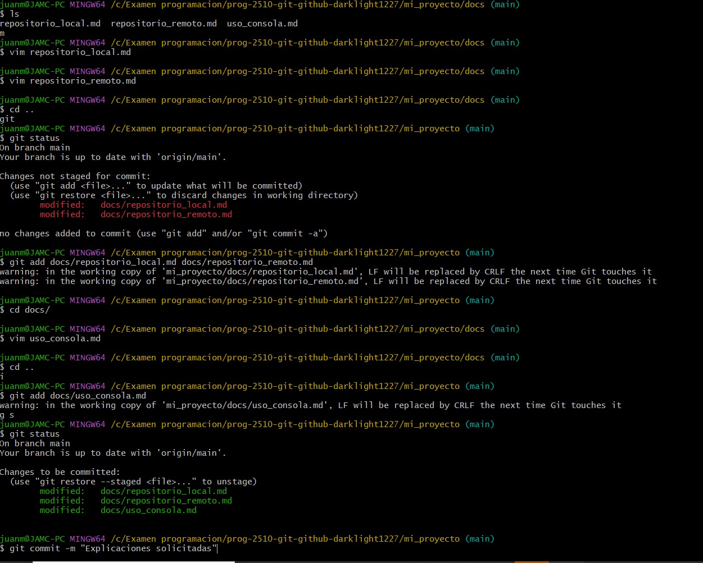

[](https://classroom.github.com/a/3WK28ho-)
# Bitácora
Nombre del estudiante: Juan Martinez  
Id.: 000559688

# Proyecto de programacion
El proyecto fue relativamente sencillo, solamente un par de veces ocurrio una confusion respecto al git status la cual termine comprendiendo después.

 Para clonar el proyecto inicie sesion en github y posterior a esto copie el link desde la pagina web para luego usar el comando
 ```
 git clone ( link )
```
 De esta forma se clona el repositorio.
 Para ejecutarlo tuve que instalar un par de aplicaciones que no tenia como github cli para iniciar sesion y demás cosas con el visual studio code.

| Link a las explicaciones de la carpeta docs :smile: :smile:
|------------------------------------------------------------------------------------------------------------------------------------|
| [Repositorio local](https://github.com/hacUPB/prog-2510-git-github-darklight1227/blob/main/mi_proyecto/docs/repositorio_local.md)  |
|------------------------------------------------------------------------------------------------------------------------------------|
| [Repositorio remoto](https://github.com/hacUPB/prog-2510-git-github-darklight1227/blob/main/mi_proyecto/docs/repositorio_remoto.md)|
|------------------------------------------------------------------------------------------------------------------------------------|
| [Uso de la consola](https://github.com/hacUPB/prog-2510-git-github-darklight1227/blob/main/mi_proyecto/docs/uso_consola.md)        |
|------------------------------------------------------------------------------------------------------------------------------------|

### Imagenes del proceso



